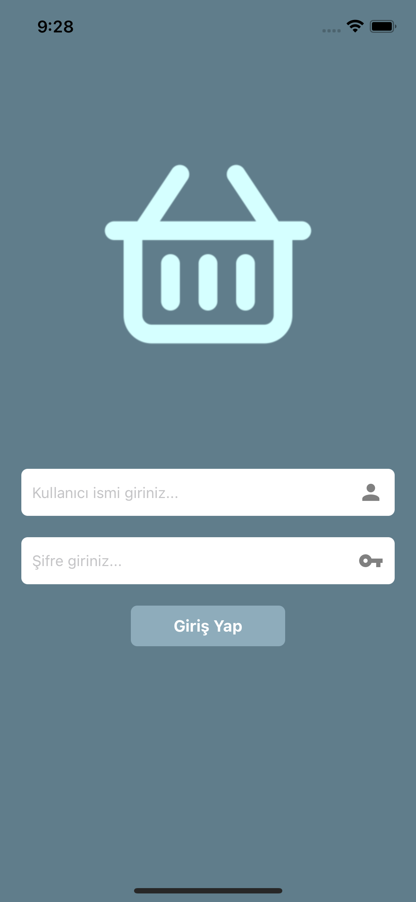
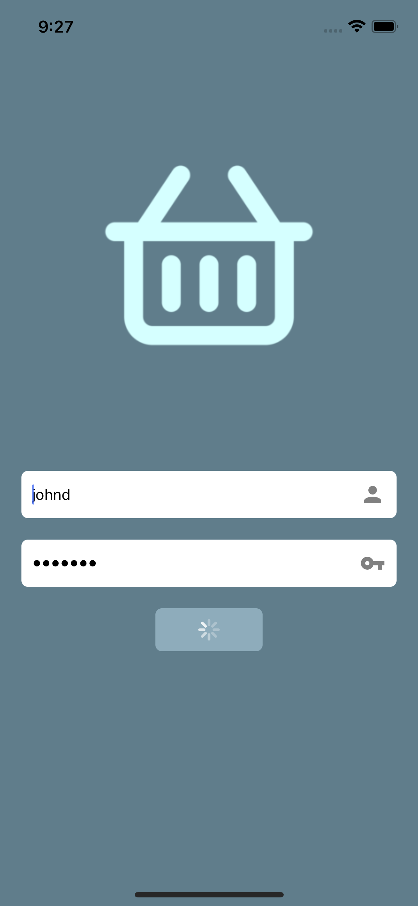
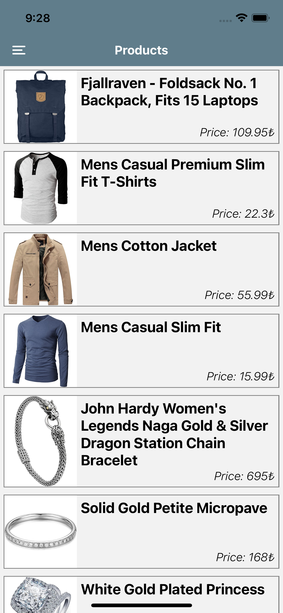
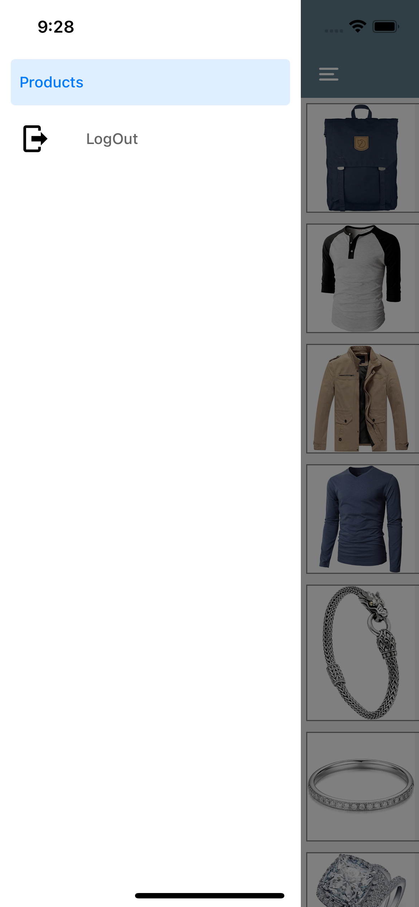
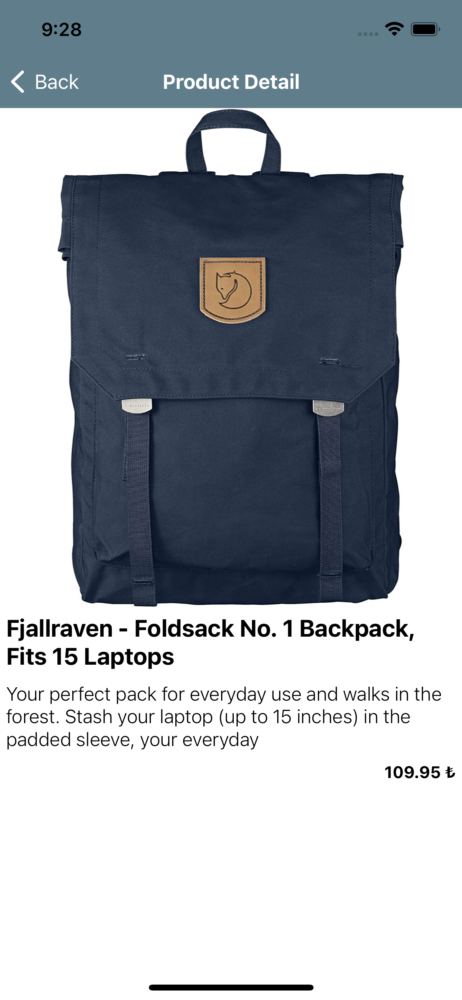

# Store
 Store with Custom hook. Custom Hook tutorial at Patika.

# Here images of Application

              

# Setup
- Install [React Native](https://reactnative.dev/docs/getting-started)
- Run on your terminal 'git clone https://github.com/bariskndmr/Tarifka.git'
- Run in root directory with terminal 'npm install'
- Run 'npx react-natice run-ios/run-android' when 'npm install' finished
